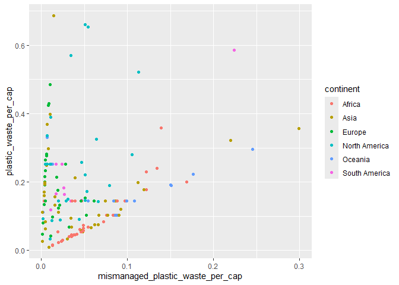
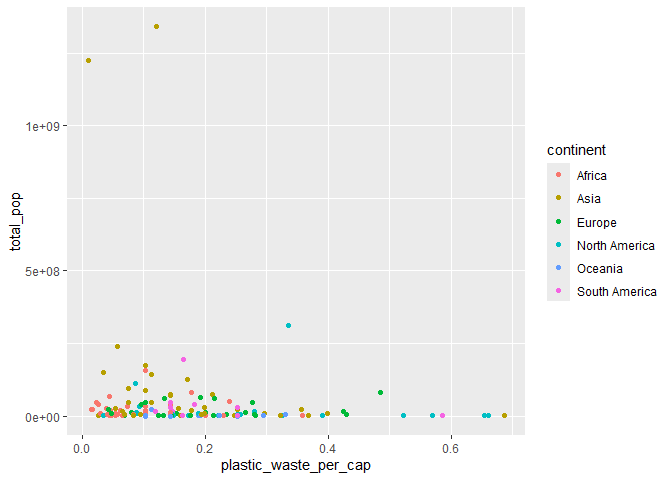

Lab 02 - Plastic waste
================
Léamarie Nadon
15 septembre 2025

## Chargement des packages et des données

``` r
library(tidyverse) 
```

``` r
plastic_waste <- read_csv("data/plastic-waste.csv")
```

Commençons par filtrer les données pour retirer le point représenté par
Trinité et Tobago (TTO) qui est un outlier.

``` r
plastic_waste <- plastic_waste %>%
  filter(plastic_waste_per_cap < 3.5)
```

## Exercices

### Exercise 1

L’europe est le continent qui produit le plus de déchets par habitant
par jour.

``` r
  ggplot(data = plastic_waste, aes(x = plastic_waste_per_cap)) +
 geom_histogram(binwidth = 0.2)+
facet_grid(~ continent)
```

<!-- -->

### Exercise 2

``` r
ggplot(data = plastic_waste, aes(x = plastic_waste_per_cap, fill = continent))+ geom_density(adjust = 0.5, alpha = 0.5)+
labs( x = "plastic_waste_per_cap", y = "Density", title = "Amount of plastic waste per cap", fill = "continent")
```

<!-- -->

Réponse à la question…

### Exercise 3

Boxplot:

``` r
ggplot(plastic_waste, aes(x = continent,
                   y = plastic_waste_per_cap)) +
     geom_boxplot() +
     labs( x = "continent",
         y = "plastic waste per cap",
         title = "Amount of plastic waste per cap in different continent")
```

<!-- -->

Violin plot:

``` r
ggplot(plastic_waste, aes(x = continent, y = plastic_waste_per_cap))+        geom_violin() 
```

<!-- -->

Réponse à la question…

### Exercise 4

``` r
ggplot(plastic_waste, aes(x = mismanaged_plastic_waste_per_cap, y = plastic_waste_per_cap, color = continent))+
  geom_point()
```

<!-- -->

Réponse à la question…

### Exercise 5

``` r
ggplot(plastic_waste, aes(x = plastic_waste_per_cap, y = total_pop, color = continent))+
geom_point()
```

    ## Warning: Removed 10 rows containing missing values or values outside the scale range
    ## (`geom_point()`).

<!-- -->

``` r
ggplot(plastic_waste, aes(x = plastic_waste_per_cap, y = coastal_pop, color = continent))+
geom_point()
```

<!-- -->

Réponse à la question…

## Conclusion

Recréez la visualisation:

``` r
# insert code here
```
